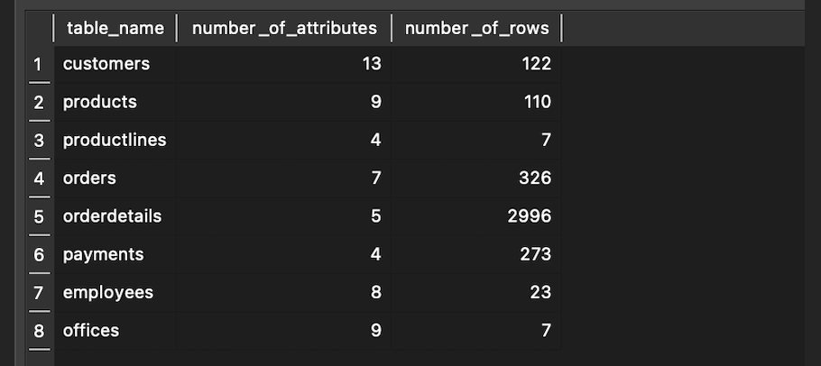
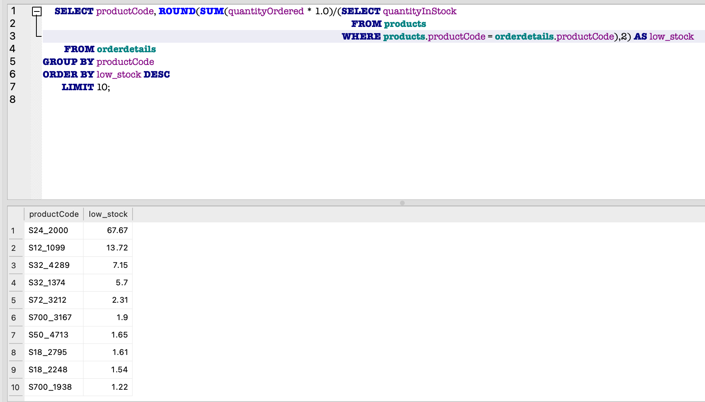
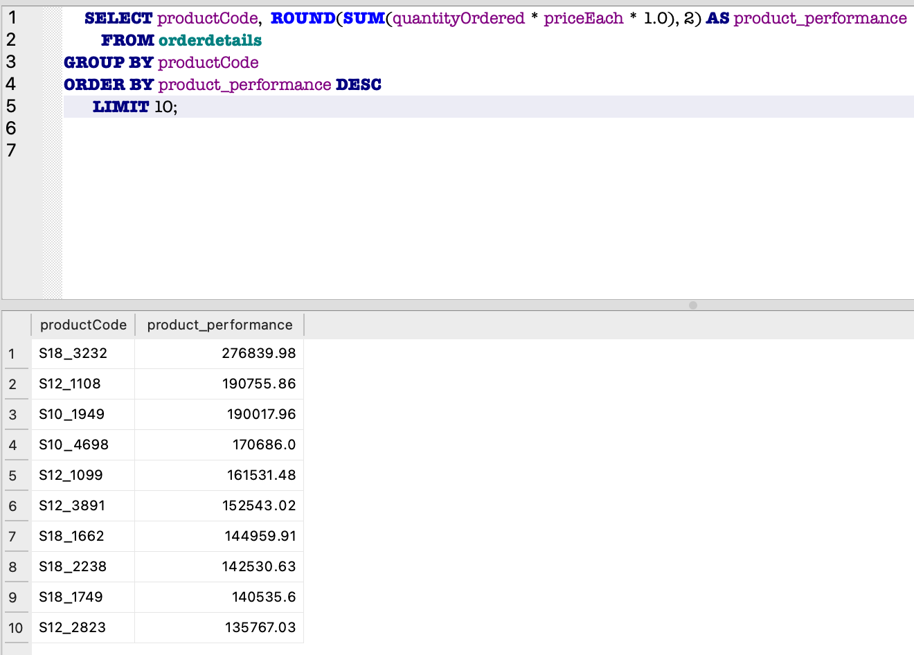
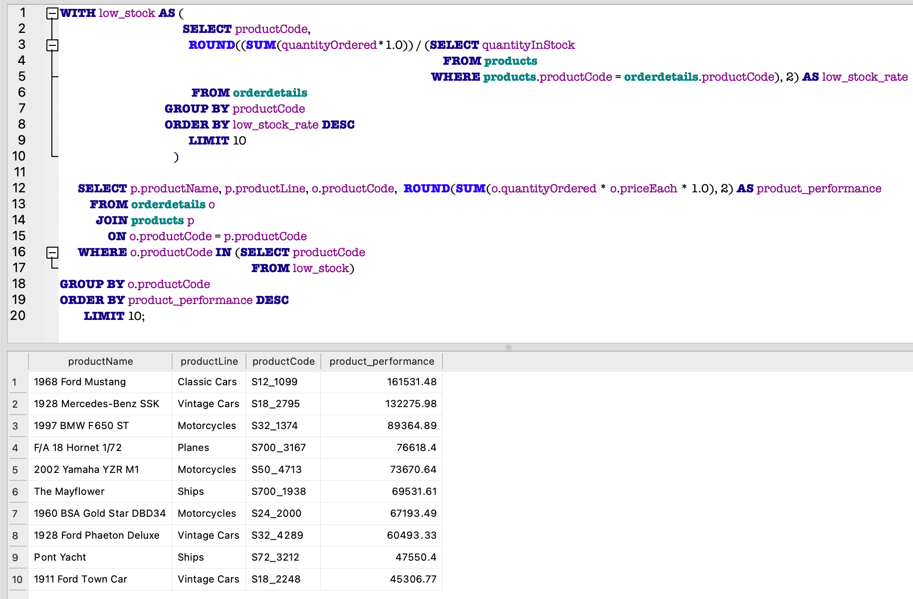
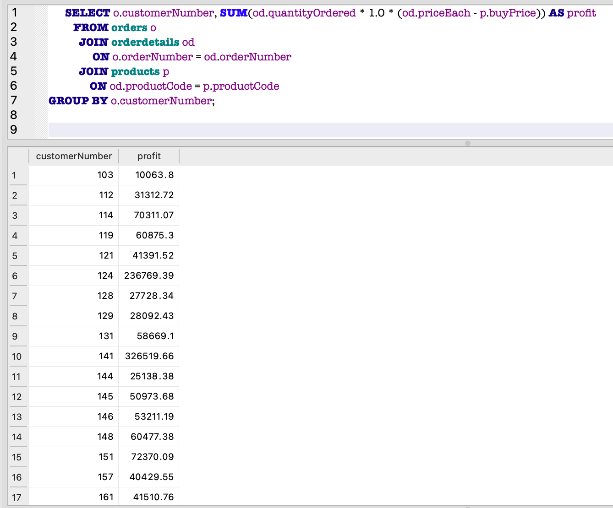
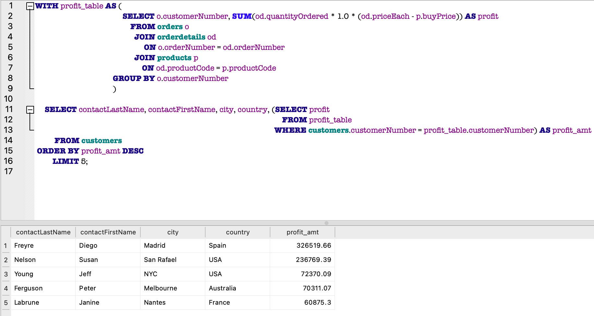
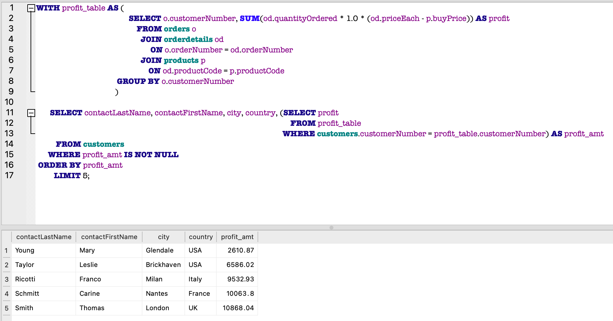
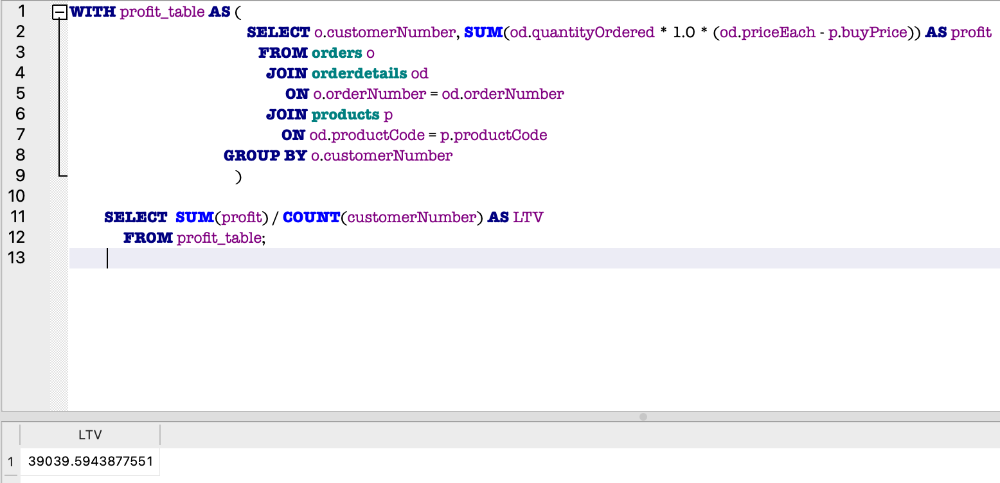
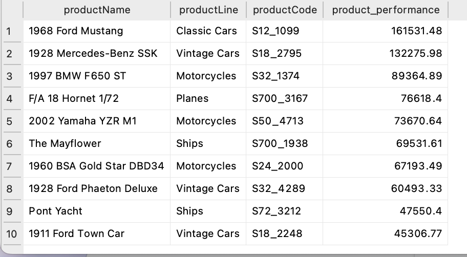
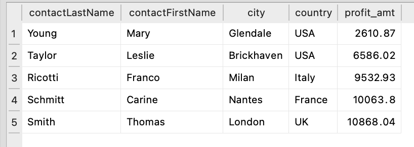

# This Dataquest project goal's is to analyze data from a sales records database for scale model cars and extract information for decision making 
## The database contains eight tables:

* Customers: customer data
* Employees: all employee information
* Offices: sales office information
* Orders: customers' sales orders
* OrderDetails: sales order line for each sales order
* Payments: customers' payment records
* Products: a list of scale model cars
* ProductLines: a list of product line categories


## 1. To create an overview of tables, with the name, number of attributes and number of rows of each table, as below

<style>
    .heatMap {
        width: 70%;
        text-align: center;
    }
    .heatMap th {
        background: blue;
        word-wrap: break-word;
        text-align: center;
    }
</style>

<div class="heatMap">

| table_name  | number_of_attributes | number_of_rows |
| ----------- | -------------------- | ---------------|
| Customers   | 13                   |            122 |
| Products    | 9                    |            110 |
| ProductLines| 4                    |              7 |
| Orders      | 7                    |            326 |
| OrderDetails| 5                    |           2996 |
| Payments    | 4                    |            273 |
| Employees   | 8                    |             23 |
| Offices     | 9                    |              7 |
|
</div>

* first step: create a row of a name, number of attributes and number of rows of an individual table

```sql
SELECT  name AS table_name,
                   (
				      SELECT COUNT(*)
					    FROM PRAGMA_TABLE_INFO('customers')
					)     AS number_of_attributes,
					(
					  SELECT COUNT(*)
					    FROM customers
					 )    AS number_of_rows
   FROM sqlite_schema
  WHERE type = 'table' AND name ='customers'
``` 
* second step: By using UNION ALL, combine the first row with another row with information of another table, including the duplicates.
```sql
UNION ALL
 
 SELECT  name AS table_name,
                   (
				      SELECT COUNT(*)
					    FROM PRAGMA_TABLE_INFO('products')
					)     AS number_of_attributes,
					(
					   SELECT COUNT(*)
					     FROM products
					 )     AS number_of_rows
  FROM sqlite_schema
 WHERE type = 'table' AND name ='products'

UNION ALL
 
 SELECT  name AS table_name,
                   (
				      SELECT COUNT(*)
					    FROM PRAGMA_TABLE_INFO('productlines')
					)     AS number_of_attributes,
					(
					   SELECT COUNT(*)
					        FROM productlines
					 )        AS number_of_rows
    FROM sqlite_schema
   WHERE type = 'table' AND name ='productlines'

UNION ALL
 
 SELECT name AS table_name,
                   (
				      SELECT COUNT(*)
					    FROM PRAGMA_TABLE_INFO('orders')
					)     AS number_of_attributes,
					(
					   SELECT COUNT(*)
					    FROM orders
					 )    AS number_of_rows
   FROM sqlite_schema
  WHERE type = 'table' AND name ='orders'

UNION ALL

 SELECT name AS table_name,
                   (
				      SELECT COUNT(*)
					    FROM PRAGMA_TABLE_INFO('orderdetails')
					)     AS number_of_attributes,
					(
					   SELECT COUNT(*)
					     FROM orderdetails
					 )     AS number_of_rows
   FROM sqlite_schema
  WHERE type = 'table' AND name ='orderdetails'

UNION ALL

 SELECT name AS table_name,
                   (
				      SELECT COUNT(*)
					    FROM PRAGMA_TABLE_INFO('payments')
					)     AS number_of_attributes,
					(
					   SELECT COUNT(*)
					     FROM payments
					 )     AS number_of_rows
   FROM sqlite_schema
  WHERE type = 'table' AND name ='payments'

UNION ALL 
 
 SELECT name AS table_name,
                   (
				      SELECT COUNT(*)
					    FROM PRAGMA_TABLE_INFO('employees')
					)     AS number_of_attributes,
					(
					   SELECT COUNT(*)
					     FROM employees
					 )     AS number_of_rows
   FROM sqlite_schema
  WHERE type = 'table' AND name ='employees'

UNION ALL

 SELECT name AS table_name,
                   (
				      SELECT COUNT(*)
					    FROM PRAGMA_TABLE_INFO('offices')
					)     AS number_of_attributes,
					(
					   SELECT COUNT(*)
					     FROM offices
					 )     AS number_of_rows
   FROM sqlite_schema
  WHERE type = 'table' AND name ='offices'
  
  ```

* The result will be the following



## 2. Which products should we order more of or less of? 

### To answer this question, we need to look at low stock (i.e. product in demand) and product performance, so that we can optimize the supply and the user experience by preventing the best-selling products from going out of stock. 


* first step: Find the low stock products, which equals to the quantity of the sum of each product ordered divided by the quantity of product in stock.
We can consider the ten highest rates. These will be the top ten products that are almost or totally out-of-stock. I run the following query to find out the top 10 low stock products. 



* second step: Find the product performance, which equals to the sum of sales of each product. I run the following query to calculate the product performance of top 10 best-selling products.



* third step: Find the products which we should order more, by looking at products with high performance which are almost out of stock. To achieve this, I combine the previous queries using a Common Table Expression (CTE) to display priority products for restocking.



## 3. How should we match marketing and communication strategies to customer behavior? 

### To answer this question, we need to find out who are the VIP customers and those who are less engaged. VIP customers bring in the most profit for the store. Less-engaged customers bring in less profit. For example, we could organize some events to drive loyalty for the VIPs and launch a campaign for the less engaged.

* first step: Let's calculate how much profit each customer generates.



* second step: Find the top 5 VIP customers by using the previous query as a CTE



* third step: Find the top 5 least engaged customers



## 4. How much can we spend on acquiring new customers?

### To answer this question, we need to know the average amount of money a customer generates during their lifetime with our store, which is Customer Lifetime Value (LTV). We can then use this to predict our future profit and decide how much we can spend on marketing.

* I calculate LTV by using the following query. 



### Conclusion

* The company needs to consider restocking the following products, as they are almost out of stock but they generate most of the sales. 



* When the company organize events to drive loyalty, we should focus on the following VIP customers.


* We need to consider the following less-engaged customers when we launch a marketing campaign.



* Our calculated Customers LTV is 39039.59 dollars, which represents how much profit an average customer generates during their lifetime with our store. We can use it to predict our future profit. So, if we get ten new customers next month, we’ll earn 390,395 dollars, and based on this prediction, we can decide how much we can spend on acquiring new customers.